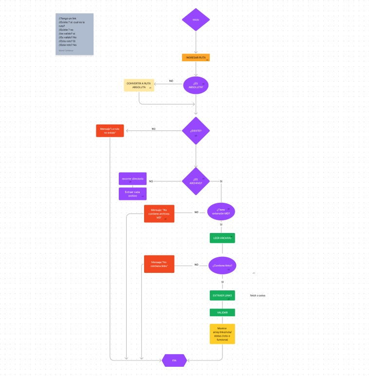

# Markdown Links

## Índice

* [1. Preámbulo](#1-preámbulo)
* [2. Resumen del proyecto](#2-resumen-del-proyecto)
* [3. Diagrama de flujo ](#3-Diagrama-de-flujo)
* [4. Valor de retorno](#4-Valor-de-retorno)

***

## 1. Preámbulo

[Markdown](https://es.wikipedia.org/wiki/Markdown) es un lenguaje de marcado
ligero muy popular entre developers. Es usado en muchísimas plataformas que
manejan texto plano (GitHub, foros, blogs, ...) y es muy común
encontrar varios archivos en ese formato en cualquier tipo de repositorio
(empezando por el tradicional `README.md`).

Estos archivos `Markdown` normalmente contienen _links_ (vínculos/ligas) que
muchas veces están rotos o ya no son válidos y eso perjudica mucho el valor de
la información que se quiere compartir.

## 2. Resumen del proyecto

El modulo mdLinks es una API que lee y analiza archivos Markdown y detecta links que se encuentren en este, entregando distintas caracteristicas de estos, como el texto que acompaña el link y si estos links estan dañados o estan buenos, ademas de la ruta del link.

## 3. Diagrama de flujo
[Link a diagrama](https://www.figma.com/file/Z7AZ24DjKNOQBp3axNHtRK/Untitled?type=whiteboard&node-id=0-1&t=7cUk0wlC3QSCPgDi-0)

### 4. Valor de retorno

Los valores de retorno de cada link contiene las siguientes propiedades

Con `validate:false` :

* `href`: URL encontrada.
* `texto`: Texto que aparecía dentro del link (`<a>`).
* `path`: Ruta del archivo donde se encontró el link.

Con `validate:true` :

* `href`: URL encontrada.
* `text`: Texto que aparecía dentro del link (`<a>`).
* `path`: Ruta del archivo donde se encontró el link.
* `status`: Código de respuesta HTTP.
* `statusText`: Mensaje `fail` en caso de fallo u `ok` en caso de éxito.

